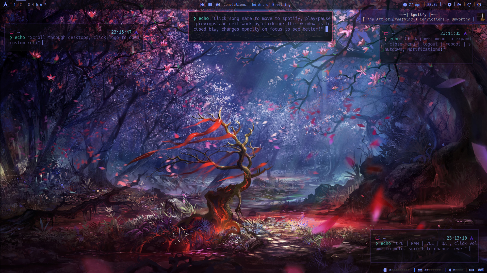
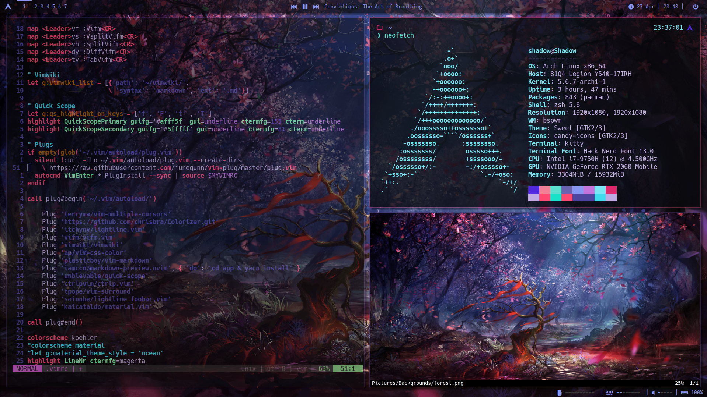
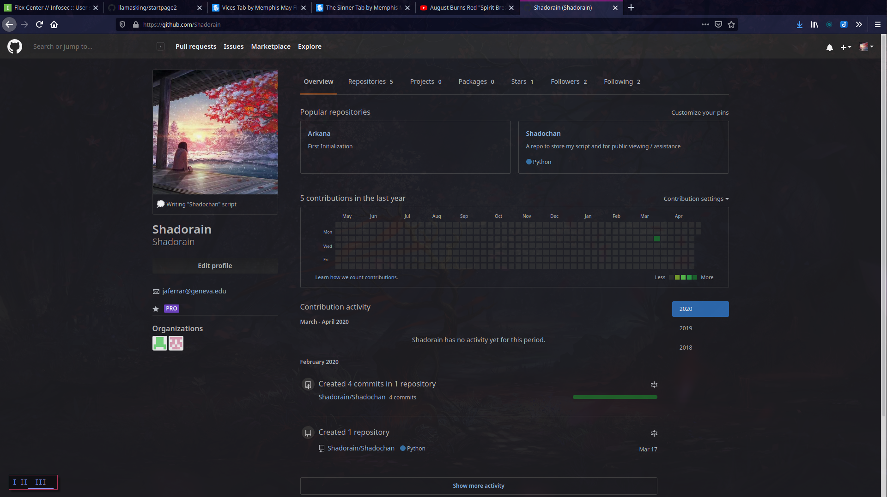
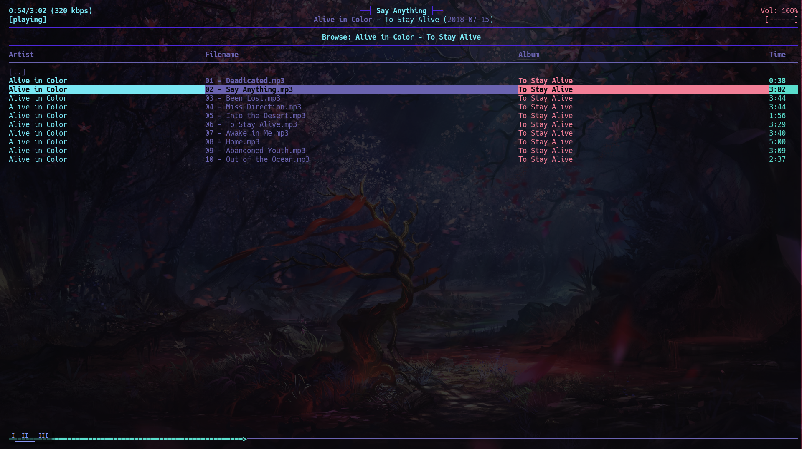

# .dotfiles
This repo holds all my rice config files!  
They are a little messy from much trial and error, but the commented out portions may help, so I left everything in :)

## Statistics
* __OS__: Arch Linux
  * _btw, I use arch_
* __WM__: BSPWM
  * __Gaps__: 12px
* __Terminal__: Kitty
* __Text Editor__: Vim (none other)
* __Shell__: ZSH
* __Compositor__: [picom-tryone-dual_kawase](https://github.com/tryone144/picom/tree/feature/dual_kawase)
* __GTK / QT__: They are hardly used, but they are candy and sweet themes
* __Bars__: Polybar (all three)
* __Menu__: Rofi (wasn't able to capture in a screenshot)
* __Media__: Spotify and MPD (ncmpcpp)
  * _metalcore is the best ;)_
* __File Manager__: vifm (gotta have those vim binds haha)
* __Browser__: Firefox
* __Font__: Hack Nerd Font (differs per program though)
* __Memory__: 16G
* __CPU__: Intel i7-9750H @ 4.500GHz
* __GPU__: NVIDIA GeForce RTX 2060 Mobile
* __Laptop__: 91Q4 Legion Y540-17IRH
* __Screen Framerate__: 144Hz
* __Screen Resolution__: 1920x1080

## Screenshots + Background
#### Theme walkthrough (Monitor 1)

Alt: Screenshot to show how the different bars and menu's work

#### Classic Rice Pic (Monitor 1)

Alt: Screenshot of classic ricing show off

#### Monitor Two Desktop

Alt: Screenshot of second monitor

#### Firefox (Monitor 2)

Alt: Screenshot of browser with slight transparency when not in focus

#### Ncmpcpp (Monitor 2)
_Great band by the way, [check them out](https://www.youtube.com/watch?v=TQAv0x4OHFE)!_

Alt: Screenshot of ncmpcpp running (focused so darker opacity)

#### The Background

Alt: The background image

## Contact
discord: Shadorain#4182
